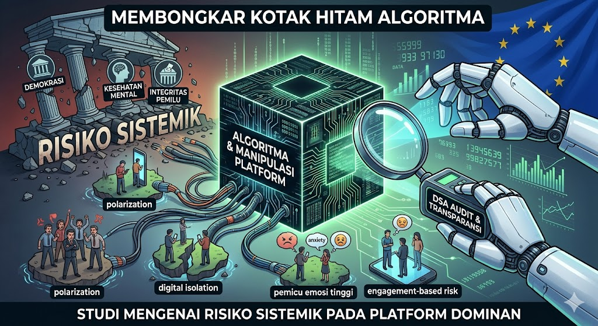

 
# Membedah "Kotak Hitam" Algoritma: Analisis Risiko Sistemik pada Platform Digital Dominan

**Oleh: Okvrillia Reony Ondri**

*Program Studi Teknik Informatika*

---

## 📝 Ringkasan Analisis
Repositori ini berisi tinjauan kritis terhadap risiko sistemik yang ditimbulkan oleh platform daring raksasa. Fokus utama analisis ini adalah mengeksplorasi bagaimana transparansi algoritma dan regulasi seperti *Digital Services Act* (DSA) berperan dalam memitigasi dampak negatif terhadap masyarakat, mulai dari integritas pemilu hingga kesehatan mental pengguna.

### 🖼️ Pratinjau Visual

---

## 📂 Lampiran Dokumen
Anda dapat mengunduh berkas lengkap hasil tinjauan melalui tautan di bawah ini:

* [📥 Download Artikel Review (PDF)](Artikel_Review_Jurnal_Okvrillia.pdf)
* [📥 Download Hasil Review Jurnal (PDF)](Hasil_Review_Jurnal_Okvrillia.pdf)

---

### 📚 Referensi Utama
Palmieri, A., Kollnig, K., & Tamò-Larrieux, A. (2026). *Systemic risks of dominant online platforms: A scoping review*. Computer Law & Security Review, Volume 60, 106262. 
🔗 [Baca Jurnal Aslinya di Sini](https://doi.org/10.1016/j.clsr.2026.106262)
